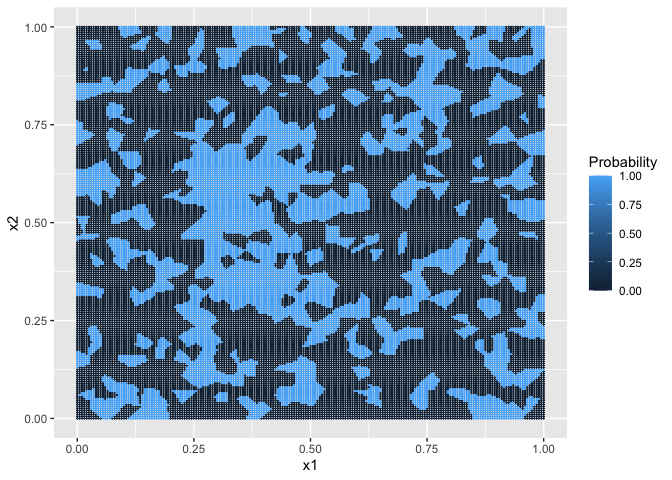
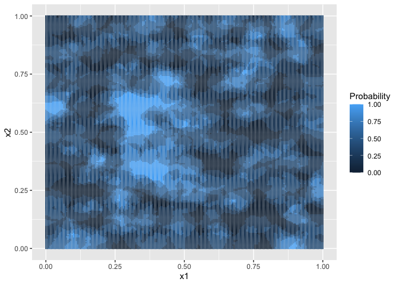
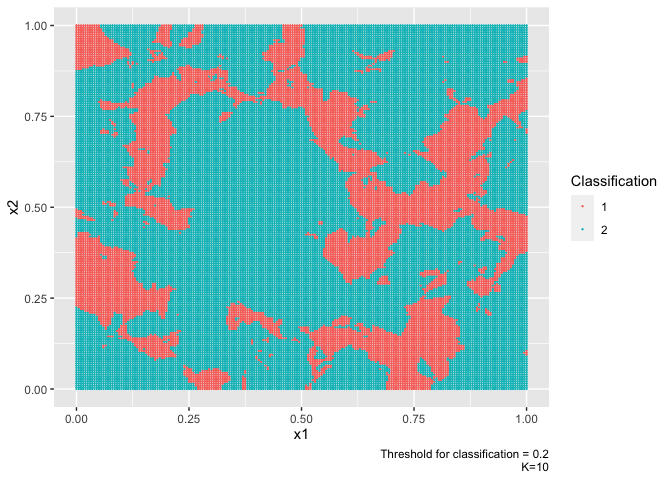
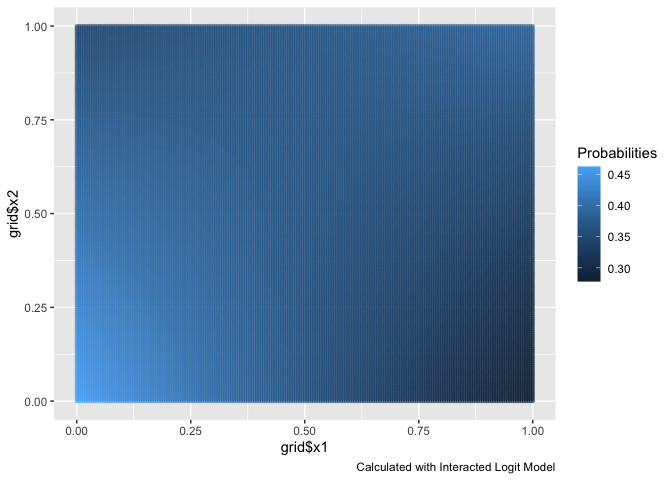
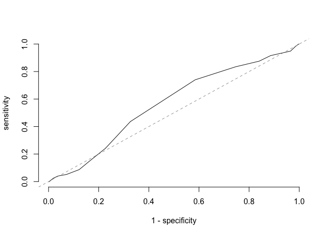
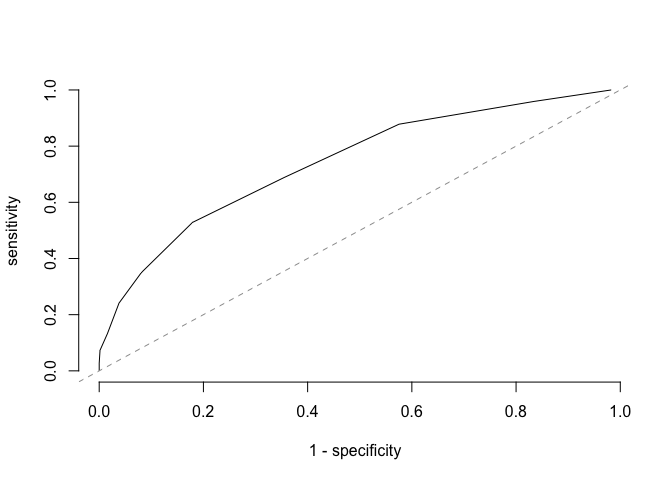

Homework 4
================
Group 8
4/28/2021

In this assignment, we will use R to make KNN predictions.

This is the function to make KNN predictions:

``` r
knn_pred = function(point,x1,x2,y,k=5) {
  dists = sqrt((x1-point[1])^2+(x2-point[2])^2) #Find all distances to current obs
  bound = sort(dists)[k]                #Find kth smallest distance
  indices = which(dists <= bound)       #Find which obs have dists 1:k
  outcomes = as.integer(y[indices])     #Find corresponding outcomes y
  round(mean(outcomes)) #Taking advantage of 2 outcomes. If more 2s, this gives 2, if more 1s this gives 1.
}
```

And this is the function used to generate probabilities for KNN
predictions:

``` r
knn_prob = function(point,x1,x2,y,k=5) {
  dists = sqrt((x1-point[1])^2+(x2-point[2])^2) #Find all distances to current obs
  bound = sort(dists)[k]                #Find kth smallest distance
  indices = which(dists <= bound)       #Find which obs have dists 1:k
  outcomes = as.integer(y[indices])     #Find corresponding outcomes y
  mean(outcomes)-1 #Taking advantage of 2 outcomes.
}
```

## Q1 - Bigger Sample

### Generate Data

First, we will run the same data generation code as used in class, but
with a sample size of 1000.

``` r
set.seed(101) # set random seed for reproducibility
n = 1000 # set sample size to 1000
x1 <- runif(n)
x2 <- runif(n)
# generate data
prob  <- ifelse(x1 < 0.5 & x1 > 0.25 & x2 > 0.25 & x2<0.75,0.8,0.3)
y  <- as.factor(rbinom(n,1,prob))
levels(y) <- c("1","2") # convert to classifications
# create dataframe
df_og <- data.frame(y=y,x1=x1,x2=x2)
```

### Plot resulting probabilities.

Then, we will plot the resulting probabilities when we use *K* = 1,
*K* = 5, and *K* = 25.

-   First, we build a grid of points to fill in.

``` r
# build a grid of points 
grid.fineness = 201
sequence <- seq(0,1,length.out = grid.fineness)
grid <- expand.grid(sequence, sequence)
colnames(grid) <- c("x1","x2")
```

-   Then we generate probabilities for each point in the grid using the
    above function (also used in class)

``` r
# generate predictions for each of these points 
yhat_k1 <- apply(grid,1,knn_pred,x1=x1,x2=x2,y=y,k=1) %>% as.factor()
yhat_k5 <- apply(grid,1,knn_pred,x1=x1,x2=x2,y=y,k=5) %>% as.factor()
yhat_k25 <- apply(grid,1,knn_pred,x1=x1,x2=x2,y=y,k=25) %>% as.factor()

# generate probabilities for each prediction
phat_k1 <- apply(grid,1,knn_prob,x1=x1,x2=x2,y=y,k=1)
phat_k5 <- apply(grid,1,knn_prob,x1=x1,x2=x2,y=y,k=5)
phat_k25 <- apply(grid,1,knn_prob,x1=x1,x2=x2,y=y,k=25)

# build a data frame with predictions and probabilities 
df <- as_tibble(grid)
df <- df %>%
  mutate(
    yhat1 = yhat_k1,
    yhat5 = yhat_k5,
    yhat25 = yhat_k25,
    phat1 = phat_k1,
    phat5 = phat_k5,
    phat25 = phat_k25
  )
```

``` r
# Plot probabilities at each point
ggplot(df,aes(x=x1,y=x2,col=phat1))+
  geom_point(size=0.08)+
  labs(color = "Probability")
```

<!-- -->

``` r
ggplot(df,aes(x=x1,y=x2,col=phat5))+
  geom_point(size=0.08)+
  labs(color = "Probability")
```

<!-- -->

``` r
ggplot(df,aes(x=x1,y=x2,col=phat25))+
  geom_point(size=0.08)+
  labs(color = "Probability")
```

<!-- -->

### Plot predictions with a threshold of 0.2

Finally, we will plot the classification *predictions* when *K* = 10,
using a probability threshold of 0.2 for our predictions instead of the
standard 0.5.

``` r
# generate probabilities and predictions when k = 10 
yhat_k10 <- apply(grid,1,knn_pred,x1=x1,x2=x2,y=y,k=10) %>% as.factor()
phat_k10 <- apply(grid,1,knn_prob,x1=x1,x2=x2,y=y,k=10)

# add to dataset
df <- df %>%
  mutate(
    yhat10 = yhat_k10,
    phat10 = phat_k10,
    # generate new y hat based on threshold 0.2  
    mod_yhat = as.factor(if_else(phat10 < 0.2,1,2))
  )
```

``` r
# plot new predictions
ggplot(df,aes(x=x1,y=x2,color=mod_yhat))+
  geom_point(size=0.08)+
  labs(color = "Classification", 
       caption = "Threshold for classification = 0.2\nK=10")
```

<!-- -->

## Q2 – Logit Comparison

### Logit model of generated data

Now, we will fit an interacted logit to this data.

``` r
logit_mod <- glm(y ~ x1 + x2 + x1:x2, data = df_og, family = "binomial")
```

### Graph of predicted probabilities using model data

Then, we will find the predicted probabilities for every point in our
grid, and plot those probabilities.

``` r
# generate predicted probabilities for grid points
preds <- predict(logit_mod,grid,type = "response")
# plot probabilities 
ggplot(df,aes(x=grid$x1,y=grid$x2,color=preds))+
  geom_point(size=0.8, alpha = 0.5)+
  labs(color = "Probabilities", 
       caption = "Calculated with Interacted Logit Model")
```

<!-- -->

## Q3 – ROC

### Plot ROC Curves for KNN and Logit

Finally, we will plot the (in-sample) ROC curves for both the logit
model and the KNN with *K* = 10.

``` r
# Function for plotting ROC Curves
roc <- function(p,y, ...){
  y = factor(y) # outcomes
  n = length(p)
  p = as.vector(p) # probabilities
  Q = p > matrix(rep(seq(0,1,length=100),n),ncol=100,byrow=TRUE)
  specificity = colMeans(!Q[y==levels(y)[1],])
  sensitivity = colMeans(Q[y==levels(y)[2],])
  plot(1-specificity, sensitivity, type="l", ...)
  abline(a=0,b=1,lty=2,col=8)
}
```

``` r
# calculate probabilities for in-sample logit model
phat_logit <- predict(logit_mod, type = "response")

# calculate probabilities for in-sample KNN model
df_yno <- df_og %>% select(-y) # remove y from dataset
phat_k10 <- apply(df_yno,1,knn_prob,x1=x1,x2=x2,y=y,k=10)

# ROC plot for logit model 
roc(p=phat_logit, y=df_og$y, bty="n")
```

<!-- -->

``` r
# ROC plot for KNN (K=10) model 
roc(p=phat_k10, y=df_og$y, bty="n")
```

<!-- -->

### Commentary on Model Selection

The KNN model looks better than the logit probability model because
there is more area under in-sample ROC curve, indicating that for a
given probability threshold, the KNN model is better at correctly
classifying y. It also appears that the KNN model improves a lot with a
relatively small increase to the probability threshold, with 0.2 as a
max.
