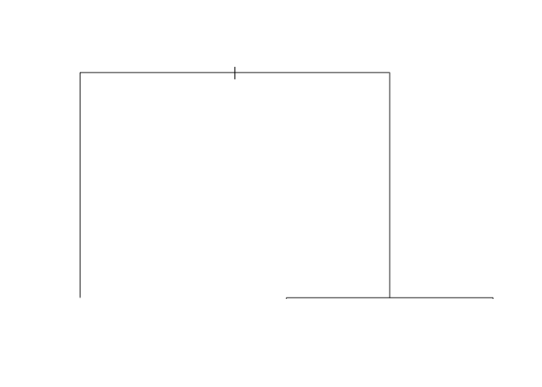

Homework 5
================
Group 8
5/12/2021

# Data

First, we will load and tidy the data. This involves converting all
variables with Y/N responses to binary dummy variables. Additionally, we
will create a *dummy variable indicating if the number of bedrooms and
bathrooms for a house are both at least two*, denoted as `twotwo`.

``` r
# load homes data from HW 3 
homes <- read_csv("https://codowd.com/bigdata/hw/hw2/homes2004.csv")

# tidy data
temp_fn <- function(x) is.character(x) & all(levels(as.factor(x)) %in% c("Y","N"))
temp_fn2 <- function(x) x == "Y"
na_relevel <- function(x) factor(x,levels=c(NA,levels(x)),exclude=NULL)

homes <- homes %>% 
  mutate(
    # For two-level variables, convert to logical
    across(where(temp_fn),temp_fn2),
    # Convert other character vars to factors
    across(where(is.character),as.factor),
    # Re-level for LASSO 
    across(where(is.factor),na_relevel),
    # Add dummy predictor for classification model
    twotwo = BATHS>=2 & BEDRMS >=2
  )
```

# Questions

## Q1 - Tree

First, we will build a tree to predict `twotwo` using all the data in
`homes`, and plot the resultant tree.

``` r
# build tree with all predictors (.)
mod1 <- rpart(twotwo ~ ., data=homes)
# add argument cp = 0
mod2 <- rpart(twotwo ~ ., data=homes, cp=0)
# plot tree
plot(mod2)
```

<!-- -->

The tree is shaped like this because `twotwo` is a binary variable
indicating indicating if the number of bedrooms and bathrooms for a
house are both at least two. Thus, the two nodes we observe will
correspond to the variables bedrooms and bathrooms and both be a split
at the value of 2.

## Q2 - Bagging

For bagging, we will:

1.  First, set aside a 20% holdout sample.

``` r
set.seed(14432)
# generate random index (20% of n)
ind = sample(nrow(homes),0.2*nrow(homes))
# subset datasets into training and holdout (test)
holdout = homes[ind,]
train = homes[-ind,]
```

2.  Them we will create 20 resampled datasets and build trees predicting
    `log(LPRICE)` with them.

``` r
# function for creating a model based on resampled data
resampled_mod = function(x) {
  ind = sample(nrow(homes),replace=T)
  rpart(log(LPRICE)~ ., data=homes[-ind,], cp=0)
}
# generated a list of 20 tree models 
mods = list() # initialize list
for (i in 1:20){
  newmod <- resampled_mod(1) # generate model
  assign(paste('mod', i, sep = ''), newmod) # col names
  mods = c(mods, list(newmod)) # add to list
  names(mods)[i] = paste('mod', i, sep = '') 
}
```

3.  Then, we will make predictions on the holdout sample for each of the
    20 tree models.

``` r
pred_helper <- function(x,xdata=holdout) predict(x,newdata=xdata)
# create list of predictions for each model
preds <- list()
for (i in 1:20){
  preds = bind_cols(preds, pred_helper(mods[[i]]))
}
```

4.  Then we average those predictions to make a ‘bagged model’
    prediction.

``` r
# take the average value of each row to create a single set of predictions
# (ncol = 1)
avg_preds <- rowMeans(preds)
```

5.  We will then find the errors for each prediction of the model (not
    the bagged-model prediction).

``` r
# generate matrix with 20 columns of repeated true values 
truth = matrix(rep(log(holdout$LPRICE),20),ncol=20,byrow=F)
# calculate error from 20 model predictions
errors <- preds - truth
```

6.  Finally, we will find the MSE for each of the tree models, as well
    as the bagged model.

``` r
# MSE for each of the tree models
MSE <- apply(errors, 2, function(x) mean(x^2))
MSE
```

    ##      ...1      ...2      ...3      ...4      ...5      ...6      ...7      ...8 
    ## 0.4657372 0.4298811 0.4363302 0.4569768 0.4456738 0.4387196 0.4460034 0.4462309 
    ##      ...9     ...10     ...11     ...12     ...13     ...14     ...15     ...16 
    ## 0.4436382 0.4276774 0.4275062 0.4350428 0.4380063 0.4642669 0.4378582 0.4613428 
    ##     ...17     ...18     ...19     ...20 
    ## 0.4325102 0.4426342 0.4318457 0.4269799

``` r
# Calculate error for bagged model
bagged_errors <- avg_preds - log(holdout$LPRICE)
# MSE for the bagged model
bagged_mse <- mean(bagged_errors^2)
bagged_mse
```

    ## [1] 0.3544896

``` r
# Calculate fraction of tree models that bag model out performs
# = num tree mods with higher MSE than bagged / tot num tree mods
length(MSE[MSE>bagged_mse])/length(MSE)
```

    ## [1] 1

The bagged model outperforms 100% of the tree models. Bagged models
really are pretty great when you think about it ;)

The line of code in \#5 creates a matrix where each row is 20 columns of
the same value - 1 to measure error for every single model with and
create a matrix of errors.

## Q3 - Forest

Using the same training data as above, we will create and test forest
models as following:

1.  First, we will make a 20-tree forest predicting `log(LPRICE)` using
    `ranger`.

``` r
smol_forest <- ranger(log(LPRICE)~., data = train, num.trees = 20)
```

2.  Then, we will make a 100-tree forest with that training data.

``` r
beeg_forest <- ranger(log(LPRICE)~., data = train, num.trees = 100)
```

3.  Then, we will make predictions for both forests on the holdout
    sample.

``` r
beeg_pred <- predict(beeg_forest, holdout)$predictions
smol_pred <- predict(smol_forest,holdout)$predictions
```

4.  Finally, we will find the the *out-of-sample* MSE for each each
    forest.

``` r
# true values in holdout sample
real <- log(holdout$LPRICE)
# calculate means squared error from true in both models
beeg_mse <- mean((beeg_pred-real)^2)
smol_mse <- mean((smol_pred-real)^2)

# print results
cat(paste('100-Forest Model: ', beeg_mse), "\n")
```

    ## 100-Forest Model:  0.421816465904412

``` r
cat(paste('20-Forest Model:  ', smol_mse))
```

    ## 20-Forest Model:   0.431523116924351

How did the forest compare to the bagged model? In 3 sentences or less,
try to explain why.

Well… its no bag.
