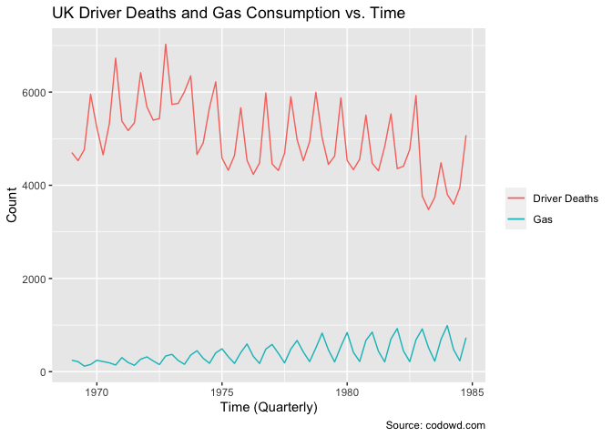
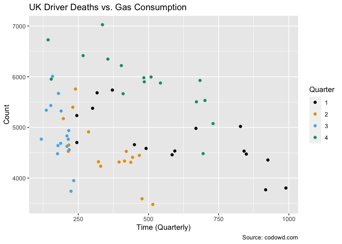

Homework 5
================
Group 8
5/12/2021

``` r
knitr::opts_chunk$set(echo = TRUE)
library(tidyverse)
```

    ## ── Attaching packages ─────────────────────────────────────── tidyverse 1.3.0 ──

    ## ✓ ggplot2 3.3.2     ✓ purrr   0.3.4
    ## ✓ tibble  3.1.0     ✓ dplyr   1.0.2
    ## ✓ tidyr   1.1.2     ✓ stringr 1.4.0
    ## ✓ readr   1.4.0     ✓ forcats 0.5.0

    ## ── Conflicts ────────────────────────────────────────── tidyverse_conflicts() ──
    ## x dplyr::filter() masks stats::filter()
    ## x dplyr::lag()    masks stats::lag()

``` r
library(ranger)
library(rpart)
library(tidymodels)
```

    ## ── Attaching packages ────────────────────────────────────── tidymodels 0.1.2 ──

    ## ✓ broom     0.7.2      ✓ recipes   0.1.15
    ## ✓ dials     0.0.9      ✓ rsample   0.0.9 
    ## ✓ infer     0.5.4      ✓ tune      0.1.3 
    ## ✓ modeldata 0.1.0      ✓ workflows 0.2.1 
    ## ✓ parsnip   0.1.5      ✓ yardstick 0.0.7

    ## ── Conflicts ───────────────────────────────────────── tidymodels_conflicts() ──
    ## x scales::discard() masks purrr::discard()
    ## x dplyr::filter()   masks stats::filter()
    ## x recipes::fixed()  masks stringr::fixed()
    ## x dplyr::lag()      masks stats::lag()
    ## x dials::prune()    masks rpart::prune()
    ## x yardstick::spec() masks readr::spec()
    ## x recipes::step()   masks stats::step()

# Data

This homework is going to focus on cleaning data. We have data on UK gas
consumption and UK driver deaths, I want to look at the relationship
between the two. Unfortunately, we have monthly data for deaths and
quarterly data for gas consumption. We will need to do some work before
we can compare them.

# Setup

Download some data:

``` r
ukg <- read_csv("https://codowd.com/bigdata/hw/hw6/ukgas.csv")
ukdd  <- read_csv("https://codowd.com/bigdata/hw/hw6/ukdriverdeaths.csv")
```

# Warning

This may not be easy or straightforward. The end product is a plot and a
regression. But cleaning data is a right pain. We will convert from wide
to long, deal with differing frequencies of data, deal with poorly
formatted variables, etc.

There are dozens of correct ways to deal with each step. I expect the
hardest subparts to be (4), then (2), then (3). For (2) and (3), a for
loop with no more than 12 ‘if’ statements can solve the problem – though
there are certainly much neater ways. For (4), there are several ways to
solve the problem, but it would be very easy to get stuck here - if you
do, please email me or post on canvas with your thoughts.

# Work

Plot quarterly deaths and quarterly gas consumption over time (on the
same plot), then regress one against the other.

1.  Convert both datasets from wide to long data.

``` r
ukdd_long <- ukdd %>%
  pivot_longer(
    cols= -year,
    names_to = "month",
    values_to = "deaths")

ukg_long <- ukg %>%
  pivot_longer(
    cols= -year,
    names_to = "quarter",
    values_to = "gas")
```

2.  Add a variable “quarter” to `ukdd`, which indicates which quarter
    (1,2,3, or 4) each month is in.

``` r
q1_mos <- c("Jan", "Feb", "Mar")
q2_mos <- c("Apr", "May", "Jun")
q3_mos <- c("Jul", "Aug", "Sep")
q4_mos <- c("Oct", "Nov", "Dec")

ukdd_long2 <- ukdd_long %>%
  mutate(
    quarter = as.numeric(case_when(
      month %in% q1_mos ~ 1, 
      month %in% q2_mos ~ 2,
      month %in% q3_mos ~ 3,
      month %in% q4_mos ~ 4
    ))
  )
```

3.  Edit the variable containing “quarter” in `ukg` so that it it
    contains only a number (1,2,3, or 4), not (Q1, Q2, Q3, Q4). \[hint:
    `str_sub` could help, and the package `stringr` more generally is
    your friend\] Be sure to convert it to a number with “as.numeric”.

``` r
ukg_long2 <- ukg_long %>%
  mutate(
    quarter = as.numeric(str_sub(quarter, 2))
  )
```

4.  Create a new dataset from `ukdd`, such that we have the total deaths
    in each quarter and year. (Jan, Feb, Mar are in Q1; Apr, May, Jun
    are in Q2; Jul, Aug, Sep in Q3; Oct, Nov, Dec in Q4. Instead of
    knowing deaths in Jan, Feb, Mar, we want deaths in Q1, which is the
    sum of deaths in Jan, Feb, Mar)

``` r
ukdd_sum <- ukdd_long2 %>%
  group_by(year,quarter)%>%
  summarize(tot_deaths = sum(deaths)) %>%
  ungroup()
```

    ## `summarise()` regrouping output by 'year' (override with `.groups` argument)

4.  Merge the two quarterly datasets together, merging on year and
    quarter. (do an inner join)

``` r
uk_merge <- inner_join(ukdd_sum, ukg_long2, 
                       by=c("year","quarter"))
```

5.  Create a new variable “time” in the merged data which is the year +
    (quarter-1)/4 – so that Q1 in 1975 has a value of 1975.0 and Q3 is
    1975.5.

``` r
uk_merge <- uk_merge %>%
  mutate(
    time = year + (quarter-1)/4
  )
```

6.  Plot quarterly UK deaths (as a line) and quarterly UK gas
    consumption (as a line) against time (on the same plot).

``` r
uk_merge %>%
  ggplot()+
  geom_line(aes(x=time, y = tot_deaths, color = "Driver Deaths"))+
  geom_line(aes(x=time, y = gas, color = "Gas"))+
  labs(
    title = "UK Driver Deaths and Gas Consumption vs. Time",
    caption = "Source: codowd.com",
    x = "Time (Quarterly)",
    y =  "Count",
    color = NULL
  )
```

<!-- -->

7.  Make a scatterplot of deaths against gas consumption, (optional:
    coloring each point by the quarter).

``` r
uk_merge %>%
  ggplot(aes(x=gas, y = tot_deaths, color = as.factor(quarter)))+
  geom_point()+
  labs(title = "UK Driver Deaths vs. Gas Consumption",
    caption = "Source: codowd.com",
    x = "Time (Quarterly)",
    y =  "Count",
    color = "Quarter")+
  scale_color_manual(values = cbbPalette)
```

<!-- -->

8.  Run a linear regression of deaths against gas consumption, and show
    the regression summary.

``` r
mod1 <- lm(tot_deaths ~ gas, data=uk_merge)

summary(mod1)
```

    ## 
    ## Call:
    ## lm(formula = tot_deaths ~ gas, data = uk_merge)
    ## 
    ## Residuals:
    ##     Min      1Q  Median      3Q     Max 
    ## -1437.3  -548.7  -208.0   622.8  1960.5 
    ## 
    ## Coefficients:
    ##              Estimate Std. Error t value Pr(>|t|)    
    ## (Intercept) 5346.3457   196.8027  27.166   <2e-16 ***
    ## gas           -0.8323     0.4257  -1.955   0.0551 .  
    ## ---
    ## Signif. codes:  0 '***' 0.001 '**' 0.01 '*' 0.05 '.' 0.1 ' ' 1
    ## 
    ## Residual standard error: 771.2 on 62 degrees of freedom
    ## Multiple R-squared:  0.05806,    Adjusted R-squared:  0.04287 
    ## F-statistic: 3.822 on 1 and 62 DF,  p-value: 0.0551

9.  In 2 sentences, describe any relationship.

The association between total driver deaths and gas consumption in the
UK is surprisingly negative–an increase in gas consumption leads to
fewer total driver deaths overall. However, this effect is somewhat
small (*β* =  − .8323), and not incredible significant (*p* = 0.0551).
